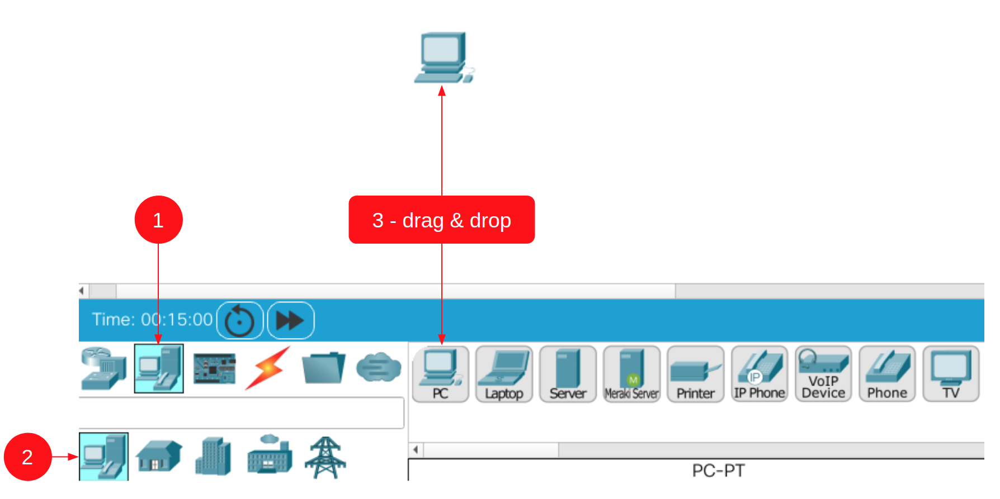
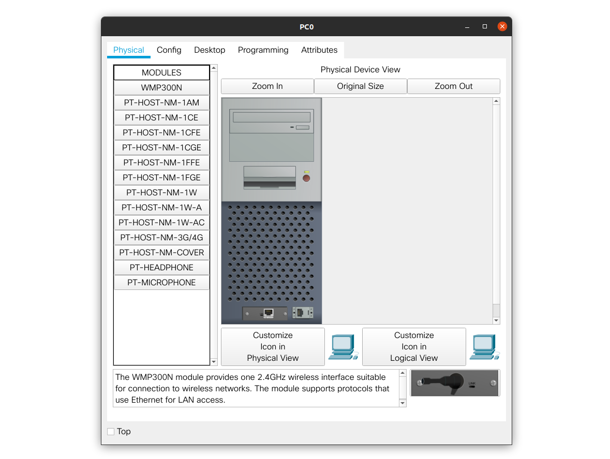
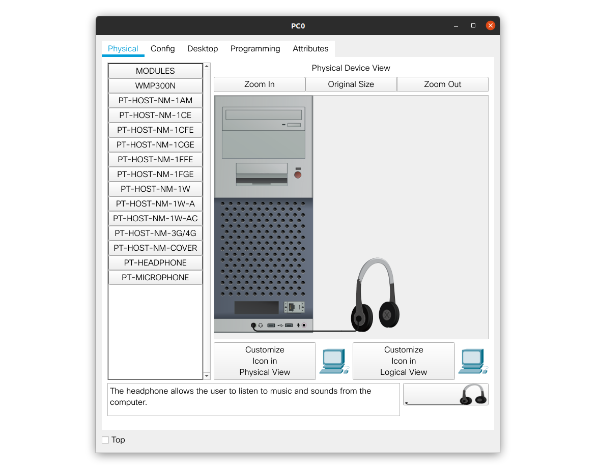
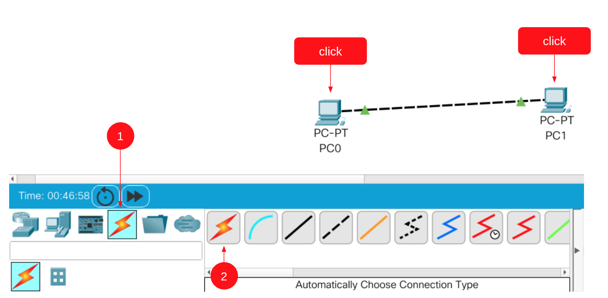
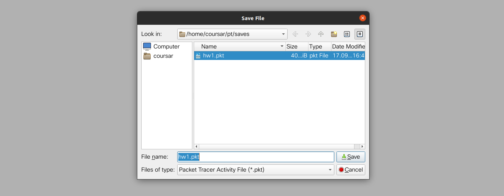

# Использование Cisco Packet Tracer

После запуска вы увидите чистую рабочую область, в которой можно размещать устройства и объединять их в сеть:

Сами устройства поделены на категории и подкатегории и расположены в нижней части экрана:

Нас будут интересовать:

1\. Сетевые устройства

2\. Оконечные устройства

4\. Соединения

Давайте начнём с простого примера: соединим два компьютера в сеть, как было показано на лекции:

##### 1\. Выбираем категорию оконечных устройств (1), подкатегория (2) по умолчанию будет выбрана первая, выбираем в панели устройств (3) нужное устройство и перетаскиваем на поле:

##### 2\. Что бы настроить само устройство, достаточно кликнуть на нём левой кнопкой мыши:

Рассмотрим по вкладкам

###### Physical

Это возможность включения/выключения устройства (красная кнопка), добавления модулей к устройству и извлечения. Переносом с панельки Modules можно добавить новое устройство, переносом с самого устройство в панельку Modules можно удалить устройство (в примере удалена одна сетевая плата и добавлены наушники):

Именно таким образом мы можем добавлять нужные платы (например 3G/4G или WiFi) к устройству.

###### Config

Здесь мы можем задавать конфигурацию модулей устройства. В Global настройках можно отображаемое имя и настройки Gateway/DNS:

Переключившись на конкретный интерфейс можно настроить его особенности:

###### Desktop

Это возможность запускать нужные "приложения":

Нас в первую очередь будет интересовать `IP Configuration` и `Command Prompt`

###### Programming и Attributes

Данные секции нас пока интересовать не будут.

#### 3\. Удаление устройств

Для перехода в режим удаления устройств необходимо нажать клавишу Delete (курсор приобретёт форму крестика) и кликнуть левой кнопкой мыши на нужном устройстве:

Для выхода из режима удаления необходимо нажать клавишу Esc

#### 4\. Соединение устройств

Для соединения двух устройств необходимо переключиться на категорию Connections (1), выбрать тип соединения (2) - мы выбрали автоматическое, и соединить, кликая левой кнопкой мыши на соединяемых устройствах:

#### 5\. Дальнейшая работа

Дальнейшая работа сводится к настройке интерфейсов и выполнению целевых команд с помощью `Comand Prompt` или запуска иных приложений на сетевых устройствах.

#### 6\. Сохранение результатов

Когда вы закончили работу со схемой, вы можете сохранить её в файле формата `*.pkt` через меню `File` `Save as`:

Указанный файл и необходимо прислать проверяющим.

#### 7\. Настройки шрифта

Для более комфортной работы вы можете зайти в меню `Options` `Preferences` и на вкладке `Font` настроить комфортный размер шрифта:

