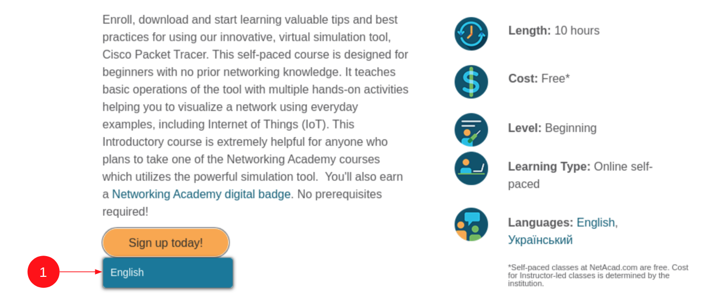
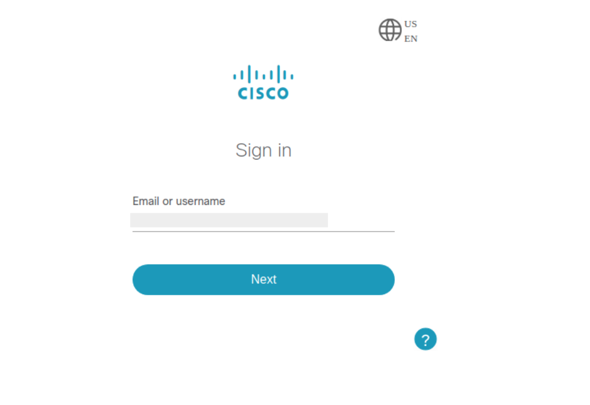
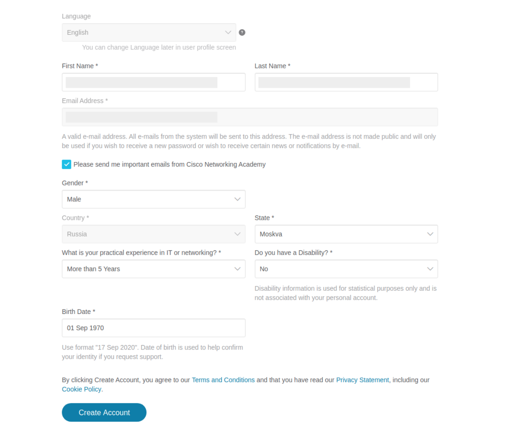
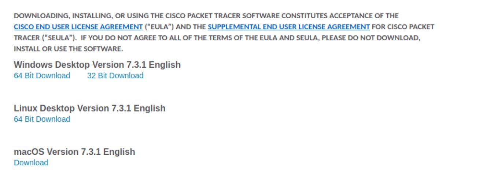
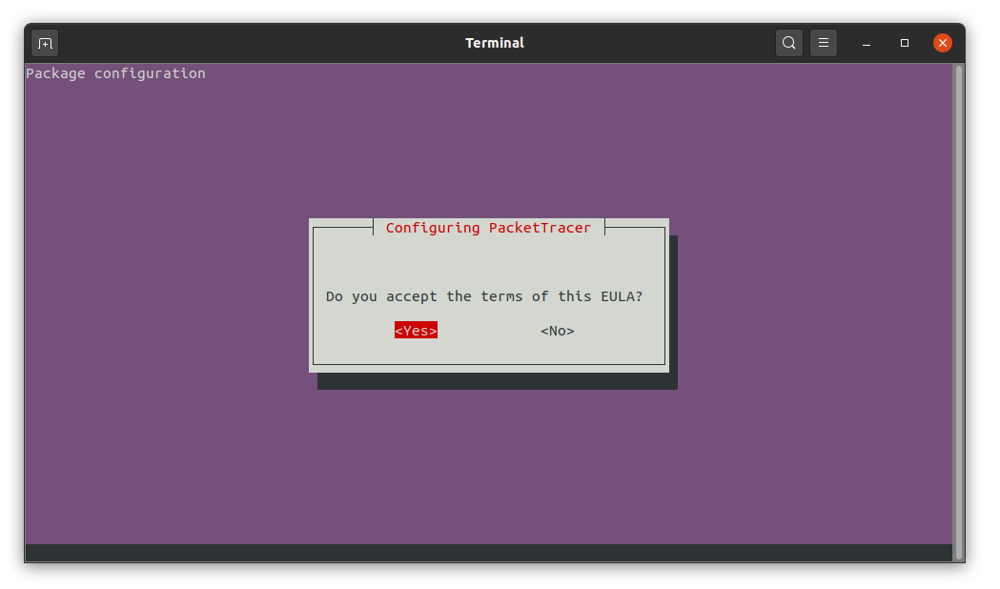

# Установка Cisco Packet Tracer

**Важно**: данный инструмент бесплатен. Не вводите нигде данные своих карт.

1\. Необходимо перейти по адресу https://www.netacad.com/courses/packet-tracer/introduction-packet-tracer и записаться на бесплатный курс от Cisco Networking Academy (в нашем курсе будет использоваться инструмент, который разработан для курсов Cisco Networking Academy и мы будем освещать его использование исключительно в привязке к курсам Cisco Networking Academy и продуктам компании Cisco)

2\. На открывшейся странице выбрать Sign up today -> English:



3\. Заполните форму саморегистрации (нужно ввести имя, фамилию, email, выбрать оповещать вас или нет, подтвердить, что вам больше 13 лет и решить математическую задачу):


4\. После этого вас перенаправит на страницу создания аккаунта Cisco (также необходимо заполнить):


5\. И на страницу входа (введите данные с шага 4):



6\. После чего потребуется ввести код подтверждения (придёт вам на email с адреса `noreply@cisco.com`):


7\. Заполните анкету на сайте Cisco для создания аккаунта:



8\. После этого перейдите в меню Resources Download Packet Tracer:


9\. Внимательно прочитайте лицензионные соглашения и скачайте версию для вашей ОС:



Не забудьте пройти сам курс (он достаточно простой и интуитивно понятный).

## Установка под Windows и Mac

Установка проходит в режиме установки обычного приложения - двойной клик на скачанном файле и следование инструкциям мастера по установке.

## Установка под Linux

Открываете [терминал](../terminal) в каталоге со скачанным дистрибутивом Packet Tracer и выполняете следующую команду:

```shell script
sudo apt install ./PacketTracer_731_amd64.deb
```

Важно: у вас может быть другая версия.

Читаете лицензионное соглашение (в конце нажмите Enter):


Подтверждаете принятие соглашения (перемещение с помощью клавиши Tab или стрелок вправо-влево, нажатие на кнопку - Enter):



Запуск самого приложения осуществляется с помощью команды:

```shell script
packettracer
```

## Первый запуск

После первого запуска вам нужно будет залогиниться используя данные созданного вами аккаунта (шаг 3).

Далее работаете в обычном режиме:


