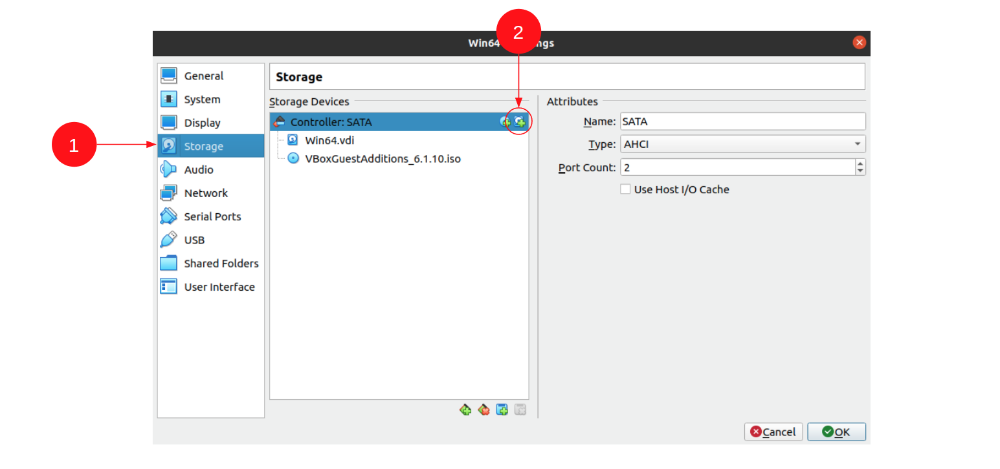
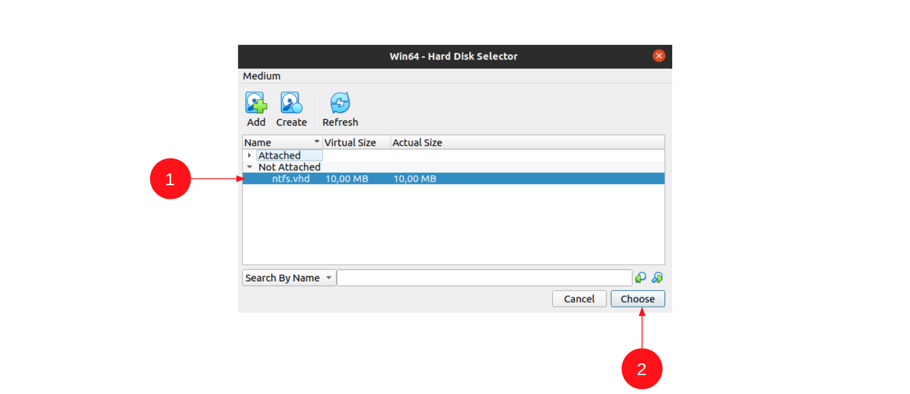
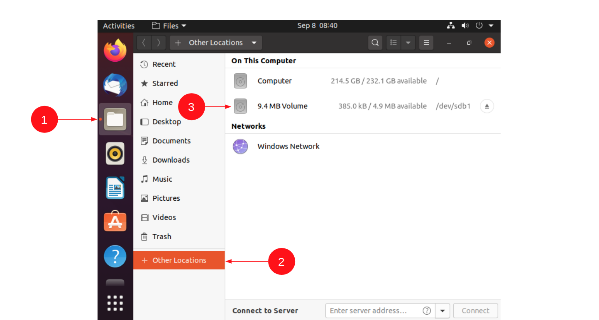

# Домашнее задание к занятию «Виртуальные машины, работа в командной строке, Linux, Windows»

В качестве результата пришлите ответы на вопросы в личном кабинете студента на сайте [netology.ru](https://netology.ru).

Рекомендуем вам предварительно ознакомиться с [руководством по установке VirtualBox](virtualbox.md)

## Задача "Анализ диска"

### Легенда

Вы работаете в ИБ-отделе компании, в здание которой запрещён внос-вынос накопителей информации без соответствующего разрешения. Все разрешённые носители промаркированы и учтены в специальном журнале.
 
Служба безопасности в ходе своей работы обнаружила неучтённый флэш накопитель на рабочем месте одного из сотрудников.

На накопителе содержался файл [disk.vhd](assets/disk.vhd)

Вас попросили проверить содержимое этого файла, поскольку самостоятельно сотрудники безопасности этого сделать не смогли.

Примечание

Это достаточно распространённая практика - на железную машину ставить чистую ОС и средство виртуализации (больше ничего, возможно, какие-то СЗИ). А работать целиком в виртуальной машине - т.к. это позволяет не "замусоривать" основную систему + снапшоты и т.д.

### Задача

Указанный файл - это файл виртуального жёсткого диска ([VHD](https://docs.microsoft.com/en-us/previous-versions/windows/desktop/legacy/dd323654(v=vs.85)) - Virtual Hard Disk). VirtualBox их тоже поддерживает.

Вам необходимо подключить этот файл и посмотреть, что находится на диске.

### Предварительные действия

Создайте виртуальную машину с ОС Ubuntu или Kali Linux.

#### Выполнение

1\. Перейдите в настройки, раздел Storage (1) и нажмите на кнопку добавления нового диска (2):

2\. Нажмите на кнопку Add Disk (1) и выберите скачанный файл ([disk.vhd](assets/disk.vhd) для Linux)

3\. Выделите добавленный диск (1) и нажмите на кнопку Choose (2):

4\. Удостоверьтесь, что диск появился в списке Storage Devices (1) и нажмите ОК (2), после чего запустите машину:

5\. После загрузки ОС диск должен отобразиться в списке дисков, для этого выберите файловый менеджер (1), затем раздел Other Locations (2) и сам диск (3):

### Результат

В качестве результата пришлите названия документов, располагающихся на диске.

