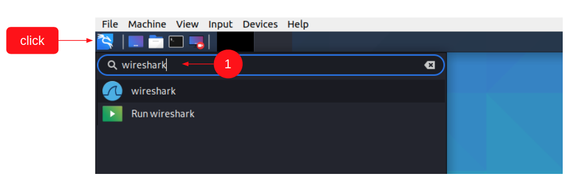
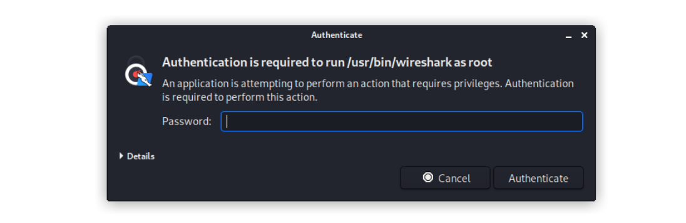
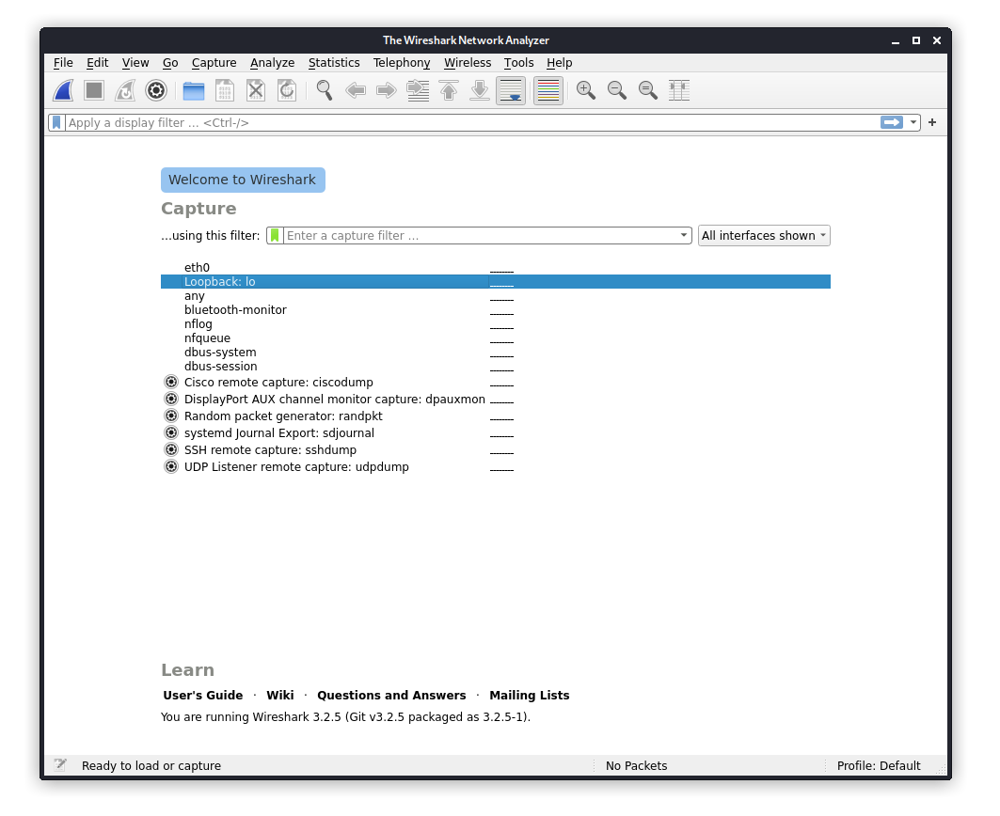
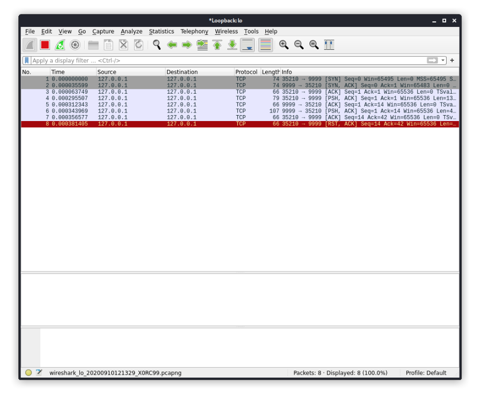
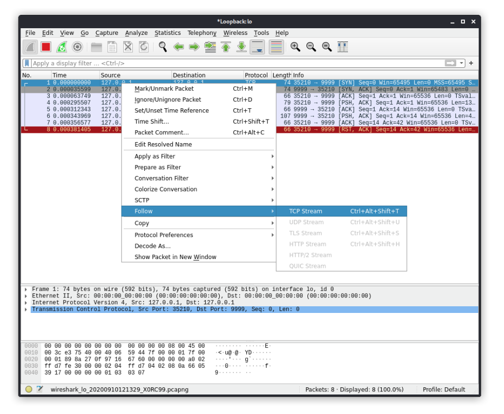
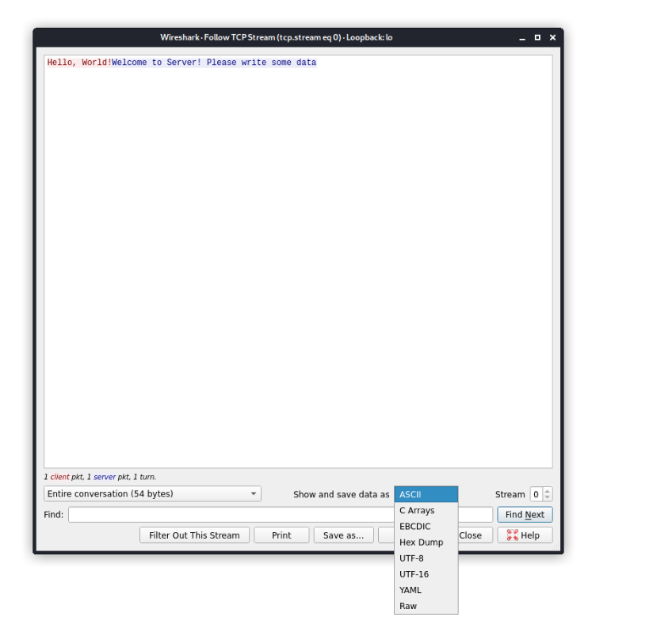

# Домашнее задание к занятию «Введение в сетевые технологии (модель OSI и стек TCP/IP)»

В качестве результата пришлите ответы на вопросы в личном кабинете студента на сайте [netology.ru](https://netology.ru).

Рекомендуем вам предварительно ознакомиться с [руководством по установке VirtualBox](virtualbox.md)

## Задача "Знакомство с Wireshark"

Мы начинаем знакомство с Wireshark - сетевым анализатором траффика.

Начнём мы с того, что попробуем проанализировать сетевое взаимодействие двух простых приложений, которое мы для вас подготовили.

Сами приложения располагаются в каталоге [assets](assets).

Вам нужно использовать:
1. [server-x64.bin](assets/server-x64.bin)
1. [text-x64.bin](assets/text-x64.bin)
1. [task-x64.bin](assets/task-x64.bin)

### Предварительные действия

Используйте виртуальную машину с Kali Linux и указанные в предыдущем разделе файлы. Если машина с Kali Linux у вас не запускается, вам придётся самостоятельно установить Wireshark с официального сайта и использовать соответствующие исполняемые файлы из каталога [assets](assets).

#### Выполнение

1\. Откройте виртуальную машину, в поисковой строке введите `wireshark`:

2\. Вас попросят ввести пароль вашего пользователя для подтверждения (`kali`, если вы скачивали OVA с официального сайта):

3\. В запустившемся окне вам необходимо выбрать интерфейс `Loopback: lo`

4\. Сохраните файлы в каком-либо каталоге (например, в `Downloads`):
1. [server-x64.bin](assets/server-x64.bin)
1. [text-x64.bin](assets/text-x64.bin)
1. [task-x64.bin](assets/task-x64.bin)

4\. Откройте терминал в данном каталоге (см. [руководство по терминалу](../terminal), открывается аналогично Ubuntu):

5\. Выполните в первой вкладке следующую команду (выставление прав на запуск приложений): `chmod +x *.bin`

6\. Запустите в первой вкладке сервер командой: `./server-x64.bin`

7\. Запустите во второй вкладке тестовый клиент для отправки сообщения: `./text-x64.bin "Hello, World!"` (сервер должен продолжать работать)

8\. В окне Wireshark вы должны увидеть следующее:

9\. Щёлкните правой кнопкой мыши на первой строке и выберите опции как на скриншоте:

10\. Вы увидите взаимодействие между клиентом и сервером в текстовом виде в кодировке ASCII:

11\. Запустите целевой клиент во второй вкладке: `./task-x64.bin`

Попробуйте проанализировать сетевое взаимодействие целевого клиента с сервером. В качестве сообщения клиент должен передать хэш SHA-256. Воспользуйтесь в этот раз не hashcat, а предвычисленными таблицами для хэшей, например [crackstation.net](https://crackstation.net) для подбора захэшированного сообщения.

### Результат

В качестве результата пришлите сообщение, переданное клиентом `task-x64.bin` серверу.

