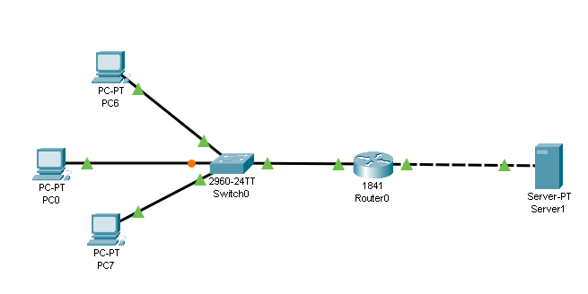

# Домашнее задание к занятию «Организация сети (ключевые устройства) и их работа»

В качестве результата пришлите ответы на вопросы в личном кабинете студента на сайте [netology.ru](https://netology.ru).

Рекомендуем вам предварительно ознакомиться с [руководством по установке Cisco Packet Tracer](installation.md) и [руководством по базовому использованию](basics.md).

## Задание

К указанной схеме (демонстрировалась на лекции) подключить ещё один компьютер (PC0 на изображении) к коммутатору, провести необходимые настройки оборудования, убедиться, что новый компьютер имеет доступ к серверу (с помощью команды `ping ip-адрес-сервера`)

Для данной схемы сети вывести заполненную таблицу коммутации на коммутаторе Switch0 (команда для вывода таблицы коммутации: `show mac-address-table`)

Пришлите pkt-файл и скриншот таблицы коммутации в качестве ответа к ДЗ в личном кабинете студента.

Примеры с лекции

Вы можете взять готовые примеры с лекции, но мы настоятельно рекомендуем вам потренироваться и самостоятельно повторить всё то, что мы делали в лекции, начиная от соединения двух компьютеров, заканчивая последней схемой.

1. [2 PC](assets/01_2pc.pkt)
1. [Hub](assets/02_hub.pkt)
1. [Switch](assets/03_switch.pkt)
1. [Router](assets/04_router.pkt)

Файлы открываются с помощью `File` `Open` из главного меню Packet Tracer.

