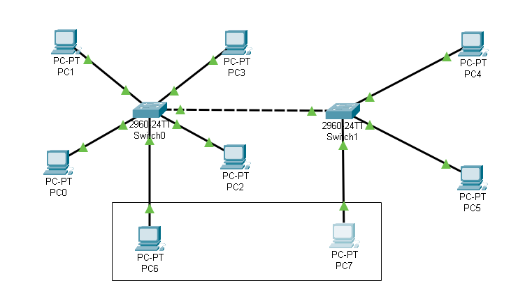
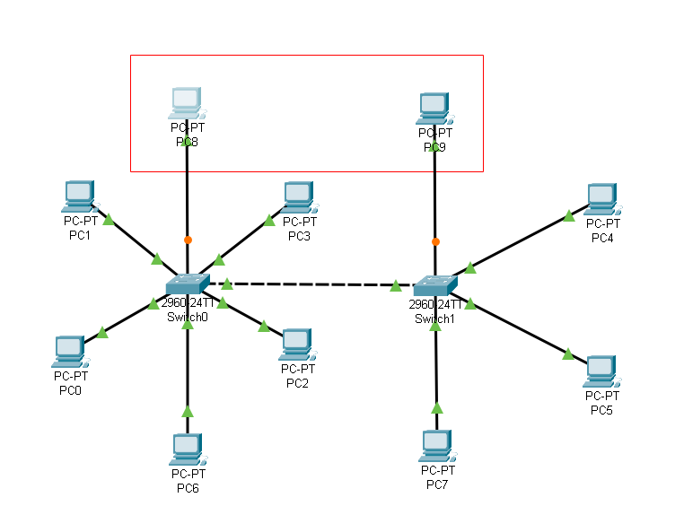

# Домашнее задание к занятию «Протоколы канального уровня»

В качестве результата пришлите ответы на вопросы в личном кабинете студента на сайте [netology.ru](https://netology.ru).

Пример с лекции

Вы можете взять готовые примеры с лекции, но мы настоятельно рекомендуем вам потренироваться и самостоятельно повторить всё то, что мы делали в лекции, начиная от соединения двух компьютеров, заканчивая последней схемой.

[VLAN](assets/vlan.pkt)

Файлы открываются с помощью `File` `Open` из главного меню Packet Tracer.

## Задание №1

К указанной схеме (демонстрировалась на лекции):
1. Добавить два компьютера PC6 и PC7, адреса (192.168.0.70, 192.168.0.80)
1. Один в VLAN 10, другой в VLAN 20 на любом коммутаторе.
1. Убедиться, что новым компьютерам доступны хосты только из этого же VLAN (с помощью команды `ping`)

Пришлите pkt-файл с названием `hw01.pkt` в качестве ответа к ДЗ в личном кабинете студента.

## Задание №2

К указанной схеме (демонстрировалась на лекции):
1. Добавить два компьютера адреса (192.168.0.100, 192.168.0.110)
1. Один в Switch0, второй в Switch1
1. Настроить оба компьютера и подключить в VLAN30 (сначала нужно создать новый VLAN на обоих коммутаторах, потом подключить в него новые хосты)
1. Убедиться, что новым компьютерам доступны хосты только из этого же VLAN (с помощью команды `ping`)

Пришлите pkt-файл с названием `hw02.pkt` в качестве ответа к ДЗ в личном кабинете студента.
