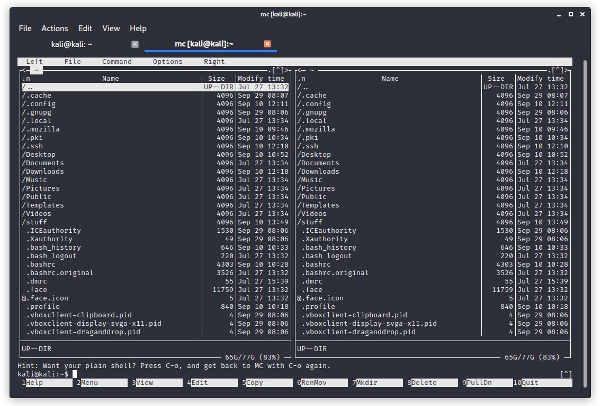
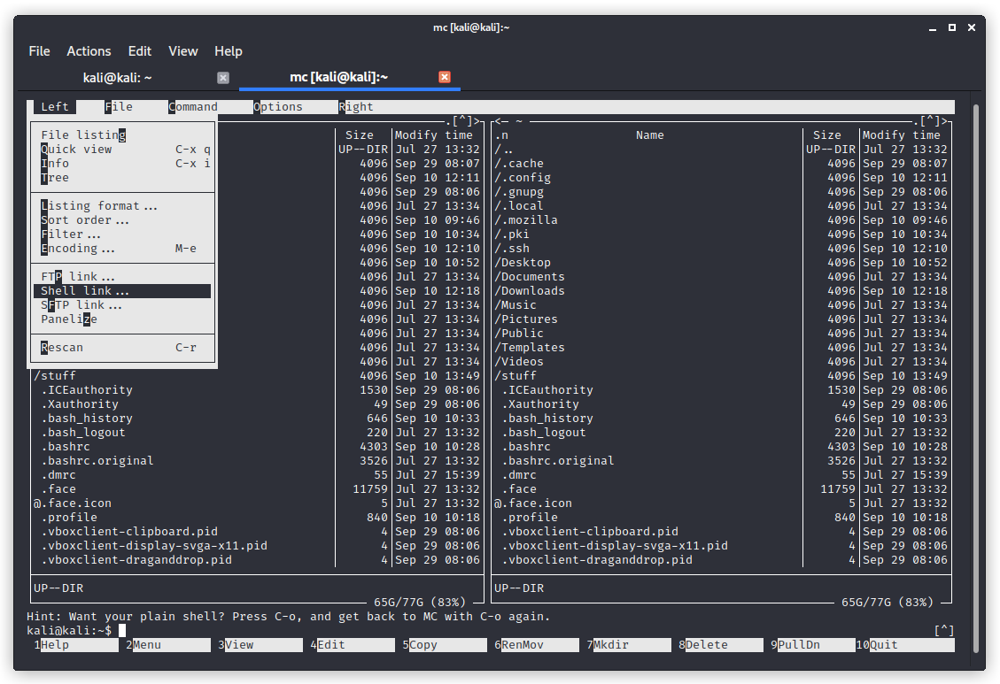

# Домашнее задание к занятию «Виртуальные частные сети (VPN)»

В качестве результата пришлите ответы на вопросы в личном кабинете студента на сайте [netology.ru](https://netology.ru).

**Важно**: убедитесь, что вы предварительно:
1. [Установили VirtualBox](../virtualbox/virtualbox.md)
1. Ознакомились с дополнительным видео по работе с виртуальными машинами
1. [Ознакомились с руководством по работе в терминале](../terminal/terminal.md) 

Материалы с лекции:
1. [WebVPN](./assets/webvpn.pkt)
1. [Site-to-Site](./assets/site2site.pkt)

## OpenVPN

В рамках данной лабораторной работы мы попрактикуемся в использовании самого популярного Open Source решения для организации VPN - [OpenVPN](https://openvpn.net/community-downloads/).

Первое с чего мы начнём - немного теории. OpenVPN предлагает два виртуальных устройства: TUN (только IP-трафик) и TAP (любой трафик). Соответственно, для приложений всё выглядит так, как будто оно использует не обычный Ethernet-интерфейс, а другой, направляя через него трафик. OpenVPN же "шифрует" данный трафик и перенаправляет его через Ethernet-интерфейс.

Поднимите две виртуальные машины:

1\. Ubuntu с Адаптер 1 - NAT и Адаптер 2 - Internal Network (10.0.0.1 - вручную)

2\. Kali с Адаптер 1 - NAT и Адаптер 2 - Internal Network (10.0.0.2 - вручную)

3\. Удостоверьтесь, что машины видят друг друга по адресам 10.0.0.1 и 10.0.0.2 соответственно (команда `ping`)

4\. Установите на обеих машинах OpenVPN:

```shell script
sudo apt update
sudo apt install openvpn
```

5\. Дополнительно на Ubuntu установите сервер openssh:

```shell script
sudo apt install openssh-server
```

6\. А на Kali - mc:

```shell script
sudo apt install mc
```

### P2P

Начнём с режима P2P (Point-to-Point).

#### PlainText

Первое, что мы сделаем, попробуем создать туннель без всяких механизмов шифрования и аутентификации.

Ubuntu
```shell script
sudo openvpn --ifconfig 10.1.0.1 10.1.0.2 --dev tun
```
Где, 10.1.0.1 - это локальный VPN endpoint, 10.1.0.2 - удалённый VPN endpoint

Kali
```shell script
sudo openvpn --ifconfig 10.1.0.2 10.1.0.1 --dev tun --remote 10.0.0.1
```
В данном случае адреса меняются местами и мы указываем к какому адресу нужно подключиться (режим P2P).

Откройте в Kali Wireshark и выберите интерфейс `eth1`.

Для тестирования мы будем использовать утилиту netcat (она позволит прослушивать на сервере определённый порт, а с клиента подключаться к этому порту).

Вам нужно и на Ubuntu и на Kali открыть ещё по одному терминалу (или вкладке терминала) и не завершая `openvpn` проделать остальные команды.

Ubuntu (прослушиваем порт 3000):
```shell script
nc -l 3000
```

Kali (подключаемся через туннель к порту 3000 сервера):
```shell script
nc 10.1.0.1 3000

Передаём любой текст, он будет отображаться на сервере в консоли
```

Удостоверьтесь в Wireshark, что данные передаются в открытом виде (`Follow UDP Stream`).

Завершите работу `openvpn` на сервере и на клиенте (Ctrl + C).

#### Shared Key

В этом режиме мы будем использовать один ключ для клиента и сервера.

Ubuntu (генерация ключа):
```shell script
openvpn --genkey --secret vpn.key
cat vpn.key
```

Ключ будет выглядеть следующим образом:
```text
#
# 2048 bit OpenVPN static key
#
-----BEGIN OpenVPN Static key V1-----
xxxxxxxxxxxxxxxxxxxxxxxxxxxxxxxx
xxxxxxxxxxxxxxxxxxxxxxxxxxxxxxxx
xxxxxxxxxxxxxxxxxxxxxxxxxxxxxxxx
xxxxxxxxxxxxxxxxxxxxxxxxxxxxxxxx
xxxxxxxxxxxxxxxxxxxxxxxxxxxxxxxx
-----END OpenVPN Static key V1-----
```

Теперь нам необходимо безопасно передать ключ с сервера на клиент. Проще всего это сделать, воспользовавшись `mc` (файловый менеджер). Запустите его, набрав в терминале `mc`:



Нажмите клавишу F9 после чего Enter, чтобы попасть в выпадающее меню. С помощью стрелок переместитесь на пункт `Shell link...` и нажмите Enter:



В строке подключения введите `ubuntu@10.0.0.1`, где `ubuntu` - это ваш логин на машине с Ubuntu (будет другой, если вы использовали образ с OSBoxes), после чего нажмите Enter:


Согласитесь с подключением (и сохранением отпечатка) к 10.0.0.1 (введите `yes` после чего нажмите Enter и введите пароль от учётной записи на машине Ubuntu):


**Важно**: пароль не будет отображаться при вводе в целях безопасности.

Вы попадёте в корневой каталог вашего Ubuntu Server'а, по которому сможете перемещаться с помощью стрелок вверх вниз, заходить в каталоги - с помощью Enter, выходить - с помощью Enter на каталоге `..`.

Копирование в правую панель (где находится файловая система вашего локального компьютера с Kali) осуществляется с помощью клавиши F5 с подтверждением клавишей Enter:


Выход из mc осуществляется с помощью клавиши F10.

Ubuntu
```shell script
sudo openvpn --ifconfig 10.1.0.1 10.1.0.2 --dev tun --secret vpn.key
```

Kali
```shell script
sudo openvpn --ifconfig 10.1.0.2 10.1.0.1 --dev tun --remote 10.0.0.1 --secret vpn.key --providers legacy default
```

Ubuntu (прослушиваем порт 3000):
```shell script
nc -l 3000
```

Kali (подключаемся через туннель к порту 3000 сервера):
```shell script
nc 10.1.0.1 3000

Передаём любой текст, он будет отображаться на сервере в консоли
```

Удостоверьтесь в Wireshark, что данные не передаются в открытом виде (`Follow UDP Stream`).

### Вопросы

1\. Пришлите скриншот Wireshark, где видно, что данные передаются в открытом виде (для раздела PlainText)

2\. Пришлите скриншот Wireshark, где видно, что данные не передаются в открытом виде (для раздела Shared Key)

На сервере или на клиенте запустите команду с флагом `--verb 3`, например, на Kali - `sudo openvpn --ifconfig 10.1.0.2 10.1.0.1 --dev tun --remote 10.0.0.1 --secret vpn.key --verb 3`

Внимательно изучите вывод и пришлите ответы на следующие вопросы:

3\. Какая версия OpenSSL используется

4\. Какой алгоритм (и с какой длиной ключа) используется для шифрования

5\. Какой алгоритм (и с какой длиной ключа) используется дла HMAC аутентификации

Посмотреть все доступные алгоритмы с помощью команд: `sudo openvpn --show-ciphers` и `sudo openvpn --show-digests` соответственно.

Указать конкретные с помощью флага `--cipher`, например, `--cipher AES-128-CBC` (или просто `--cipher AES128`) и `--auth`, например, `--auth SHA256`, соответственно (удостоверьтесь, что после указания иных алгоритмов в логе вывод тоже меняется).

6\. Что будет выведено в консоли сервера (`sudo openvpn --ifconfig 10.1.0.1 10.1.0.2 --dev tun --secret vpn.key --cipher AES128 --auth SHA256 --verb 3`), если:

6\.1\. Подключиться с клиента командой: `sudo openvpn --ifconfig 10.1.0.2 10.1.0.1 --dev tun --remote 10.0.0.1 --secret vpn.key --cipher AES256 --auth SHA256 --verb 3`

6\.2\. Подключиться с клиента командой: `sudo openvpn --ifconfig 10.1.0.2 10.1.0.1 --dev tun --remote 10.0.0.1 --secret vpn.key --cipher AES128 --auth SHA512 --verb 3`
