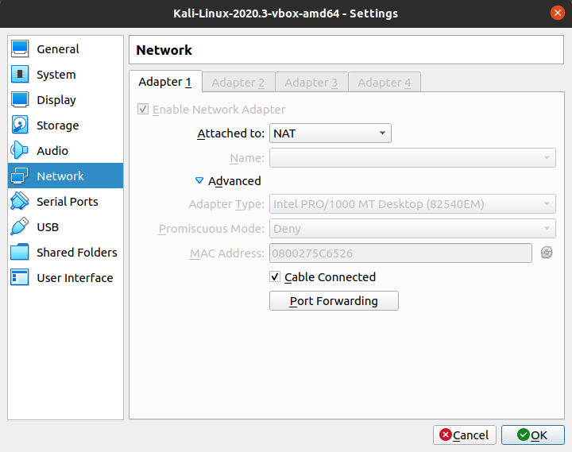

# Домашнее задание к занятию «Протоколы сетевого уровня: IPv4, IPv6»

В качестве результата пришлите ответы на вопросы в личном кабинете студента на сайте [netology.ru](https://netology.ru).

Пример с лекции

Вы можете взять готовые примеры с лекции, но мы настоятельно рекомендуем вам потренироваться и самостоятельно повторить всё то, что мы делали в лекции, начиная от соединения двух компьютеров, заканчивая последней схемой.

* [Router](assets/router.pkt)
* [PAT](assets/pat.pkt)

Файлы открываются с помощью `File` `Open` из главного меню Packet Tracer.

## Задание №1. Погружение в адресацию IPv4

На одной из виртуальных машин (можете с Kali Linux):

1\. Запустите программу Wireshark

2\. Запустите захват с интерфейса, через который вы выходите в Интернет

3\. Введите фильтр "icmp"

4\. Не закрывая Wireshark, откройте консоль и выполните команду:

`tracert yandex.ru` (Windows)

`traceroute yandex.ru` (Linux/Mac), возможно её потребуется установить через `sudo apt install traceroute` (в Ubuntu/Kali) или `brew install traceroute` (Mac)

Примечание: если внутри VirtualBox команда `traceroute yandex.ru` не даёт результатов (вы видите одни звёздочки), то запустите в формате: `sudo traceroute -I yandex.ru` (I - i большое, а не l).

5\. Дождитесь завершения работы программы и остановите сбор пакетов в Wireshark

6\. Посмотрите ваш частный IP-адрес (по данным Wireshark). Для этого вам нужно открыть любой пакет и изучить поля "Internet Protocol Version 4" `Src` и `Dst`

TTL

В протоколе IPv4 существует специальный механизм, предотвращающий  бесконечное зацикливание пакетов в сети,  которое может произойти, наприме, из-за ошибок адресации. Для этого в заголовке пакета присутствует специальное однобайтное поле TTL (Time-to-live), определяющее максимальное количество "прыжков" (hop) между маршрутизаторами, которое может сделать этот пакет. 

При создании пакета, в это поле записывается определённое  значение (128 для Windows, 64 для Linux). Затем, каждый маршрутизатор, через который проходит пакет,  уменьшает значение этого поля на 1 и когда оно станет равно нулю, маршрутизатор уничтожит такой пакет. При этом,  отправителю посылается сообщение протокола ICMP (Time Exceeded)

Таким образом, поле TTL можно интерпретировать, как количество маршрутизаторов, которое может пройти этот пакет. 

7\. Перейдите на сайт https://myip.ru/, чтобы посмотреть на свой общедоступный ip-адрес

Ответьте на следующие вопросы:

1\. Сколько маршрутизаторов находится между вами и сайтом yandex.ru?

2\. Адрес какого устройства показан первым в этом списке?

3\. Узел с каким адресом из предыдущего списка подменяет ваш частный адрес ip-адрес на общедоступный?

В качестве ответа пришлите:

1\. Скриншот вывода работы утилиты `tracert` или `traceroute`*

2\. Количество маршрутизаторов между вашей машины (с которой вы выполняете `tracert`/`traceroute`) и сайтом [yandex.ru](https://yandex.ru)

3\. Адрес какого устройства показан первым в этом списке (т.е. что это за устройство)?

3\. Узел с каким адресом из предыдущего списка подменяет ваш частный адрес IP-адрес на общедоступный?

**Важно***: в целях сохранения конфиденциальности, вы можете "замазать" на скриншоте IP-адреса и в ответах присылать лишь номер соответствующей строки из скриншота. 

VirtualBox и 10.0.2.2

Когда вы работаете с VirtualBox, то по умолчанию гостевые машины подключаются к сети в режиме NAT.

Что это за режим?

Каждая виртуальная машина подключается в изолированном режиме к виртуальному роутеру с адресом 10.0.2.2 и каждой VM автоматически назначается адрес 10.0.2.15 (поскольку эти подключения изолированы друг от друга).

И виртуальный роутер уже отвечает за дальнейшее перенаправление пакетов. В частности, если вы запустите Wireshark в VM и на хосте, то пинг будет показаывать:
* в VM - 10.0.2.15
* в хосте - IP хоста

## Задание №2 Расчёт маски

1\. Перейдите на сайт http://jodies.de/ipcalc

2\. Возьмите адрес 10.0.0.1 и маску /24 и сделайте два следующих пункта:

а) Разбейте данный диапазон адресов на 2 подсети (подсказка: длина маски увеличиться на 1 бит)

б) Разбейте данный диапазон адресов на 8 подсетей

В качестве ответа пришлите: для каждой второй сети (для пунктов а и б):
1. Маску сети
1. Количество хостов
1. Адрес сети и широковещательный адрес
1. Диапазоны адресов хостов (например, 10.0.0.1 - 10.0.0.254)
