# Домашнее задание к занятию «Работа сети Интернет (часть 2): HTTP, HTTPS, HTTP2»

В качестве результата пришлите ответы на вопросы в личном кабинете студента на сайте [netology.ru](https://netology.ru).

## nginx

В этом задании мы посмотрим, как настраивается самый популярный HTTP-сервер - [nginx](https://www.nginx.com/), сгенерируем и установим туда самоподписанный сертификат (это типичная задача внутри организаций - нужно обеспечить защищённый канал, но покупать сертификат для целей разработки или внутреннего обмена желания нет).

Вам потребуются:
1. Виртуальная машина с Ubuntu: Адаптер 1 - NAT и Адаптер 2 - Internal Network (10.0.0.1 - вручную)
1. Виртуальная машина с Kali: Адаптер 1 - NAT и Адаптер 2 - Internal Network (10.0.0.2 - вручную) 
1. Виртуальная машина с Windows: Адаптер 1 - NAT и Адаптер 2 - Internal Network (10.0.0.3 - вручную) 

### Документация

Часть документации на nginx представлена на русском. Чтобы не повторяться, мы рекомендуем предварительно ознакомиться с ними:
* [руководство для начинающих](https://nginx.org/ru/docs/beginners_guide.html)
* [список директив](https://nginx.org/ru/docs/dirindex.html)
* [HTTPS](https://nginx.org/ru/docs/http/configuring_https_servers.html)

### Установка, настройка nginx

#### Установка пакетов

Все действия из этого раздела выполняются на машине с Ubuntu.

Откройте терминал и выполните следующие команды для установки необходимых пакетов:
```shell script
sudo apt update
sudo apt install nginx openssl mc vim
```

Поcле установки nginx автоматически запустится на 80-м порту. Нас будут интересовать HTTP (80) и HTTPS (443). Откройте их на файерволле, если он у вас включен:

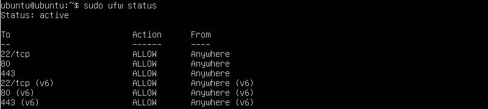

Проверить статус nginx можно с помощью команды:
```shell script
systemctl status nginx
``` 

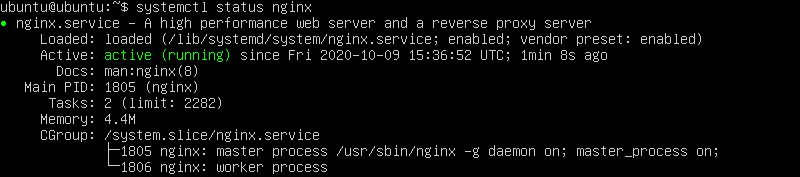

Убедитесь с машины с Kali, что HTTP сервер на Ubuntu открывается на 80 порту (для этого в браузере откройте http://10.0.0.1 - браузер автоматически обратиться по порту 80):

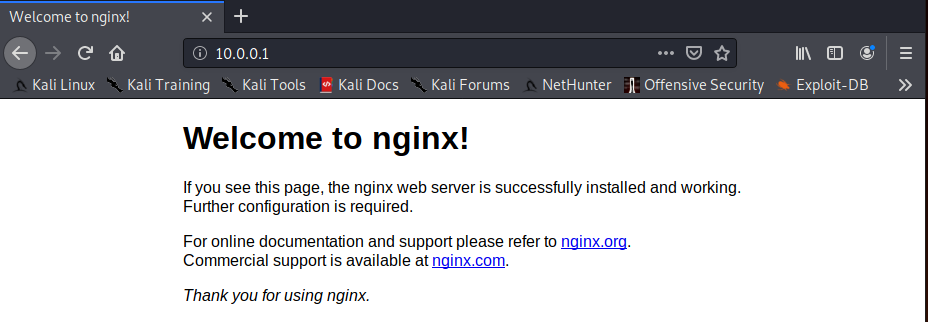

Можете дополнительно удостовериться с помощью WireShark, что данные передаются в открытом виде.

#### Настройка и генерация сертификатов

Каталог `/etc` - общий каталог, в котором хранятся ключевые конфигурационные файлы системы и сетевых сервисов. После установки Nginx, появится там и каталог для Nginx.

Нам необходимо перейти туда и создать там каталог, в котором будут храниться наши сертификаты:
```shell script
cd /etc/nginx
sudo mkdir certs
cd certs
```

Далее сгенерируем самоподписанный сертификат с помощью OpenSSL:
```shell script
sudo openssl req -newkey rsa:2048 -nodes -x509 -days 365 -keyout key.pem -out certificate.pem -subj "/C=RU/ST=Moscow/L=Moscow/O=Security/OU=Security/CN=netology.local" -addext "subjectAltName=DNS:netology.local"
```

Что это команда делает: генерирует сертификат и ключ с заполненными данными (в данном случае на домен netology.local).

В итоге в вашем каталоге должно появиться два файла:
1. `certificate.pem`
1. `key.pem`

Далее необходимо настроить конфигурационный файл nginx.

Для этого у вас есть несколько вариантов:
1. Самый правильный 😈 - Vim (предварительно желательно пройти vimtutor, чтобы не перезагружать компьютер для выхода)
1. Вариант попроще - использовать встроенный в mc редактор mcedit (или любой другой, например, nano)

```shell script
sudo vim /etc/nginx/sites-enabled/default
```

Или для mc:
```shell script
sudo mcedit /etc/nginx/sites-enabled/default
```

Вы увидите следующую картинку:


Или следующую (если использовали mcedit: кнопки снизу F2 - сохранить, F10 - выйти):


Вам нужно отредактировать имеющуюся конфигурацию, чтобы получить следующую (комментарии - то, что начинается с `#` удалены для краткости):
```text
server {
  # имя нашего сервера
  server_name netology.local;

  # слушаем на 443 порту
  listen 443 ssl;
  listen [::]:443 ssl;
  # пути к сертификату и ключу
  ssl_certificate /etc/nginx/certs/certificate.pem;
  ssl_certificate_key /etc/nginx/certs/key.pem;
  # какие протоколы поддерживаем
  ssl_protocols TLSv1.3;

  # где искать файлы, выдаваемые пользователю
  root /var/www/html;

  # какой файл выдавать по умолчанию
  index index.html index.htm index.nginx-debian.html;

  location / {
    try_files $uri $uri/ =404; 
  }     
}

server {
  server_name netology.local;

  if ($host = netology.local) {
    return 301 https://$host$request_uri;
  }

  listen 80;
  listen [::]:80;

  return 404;
}
```

**Важно**: это демонстрационная конфигурация, не используйте её в production!

Проверяем конфигурацию на отсутствие ошибок с помощью команды:
```shell script
sudo nginx -t
```

Если вывод соответствует нижепредставленному, то можно двигаться дальше (если нет, читаете ошибку и исправляете):
```text
nginx: the configuration file /etc/nginx/nginx.conf syntax is ok                                                                                                                                                                     
nginx: configuration file /etc/nginx/nginx.conf test is successful
```

Загружаем новую конфигурацию nginx:
```shell script
sudo nginx -s reload
```

### Настройка Kali

Теперь мы хотим по домену `netology.local` обращаться к тому серверу, который работает по адресу 10.0.0.1. Самый простой способ для этого (чтобы не поднимать DNS) - это отредактировать файл `/etc/hosts`.

В Kali:

```shell script
sudo vim /etc/hosts
```

Приведите его к следующему виду (добавлена третья строка):

```shell script
127.0.0.1    localhost
127.0.1.1    kali
10.0.0.1     netology.local

# ниже часть не приведена
```

После этого в браузере откройте https://netology.local (и нажмите на кнопку `Advanced`):


Что мы видим? Фактически, нам говорят, что сертификат соответствует домену, но не является доверенным, поскольку является самоподписанным.

Если нажать на `View Certificate`:

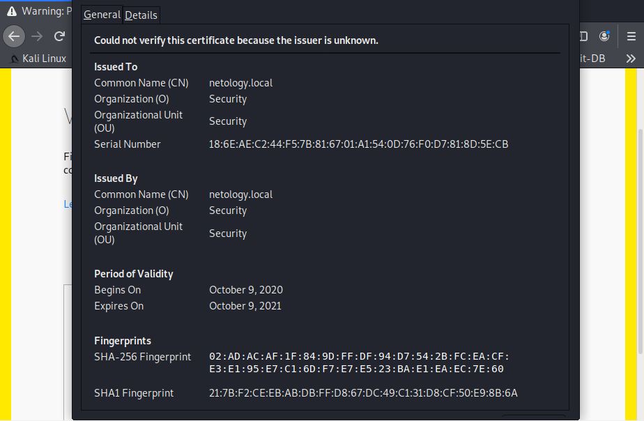

Теперь проверим часть, которую мы настроили в нашем конфиге для перехода с http на https с кодом (301):
```text
server {
  server_name netology.local;

  if ($host = netology.local) {
    return 301 https://$host$request_uri;
  }

  listen 80;
  listen [::]:80;

  return 404;
}
```

Введите адрес http://netology.local и удостоверьтесь, что вас перебрасывает на https://netology.local (можете посмотреть в консоли разработчика - F12):

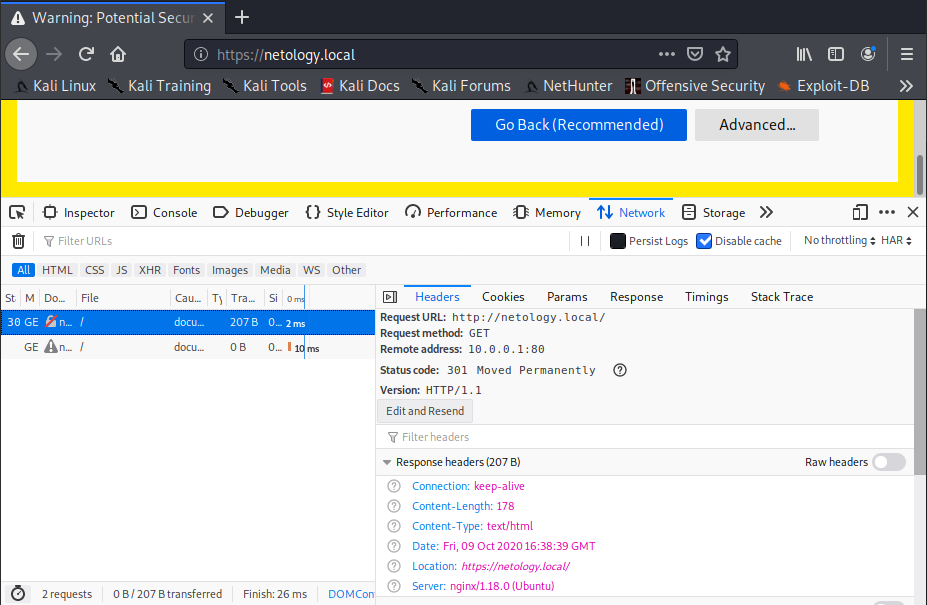

Теперь, если вы нажмёте на `Accept Rist and Continue`, браузер вам загрузит данные по HTTPS, что вы можете увидеть в WireShark:

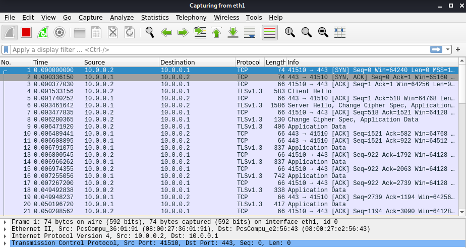

Посмотреть сертификат можно щёлкнув на замочке в адресной строке:

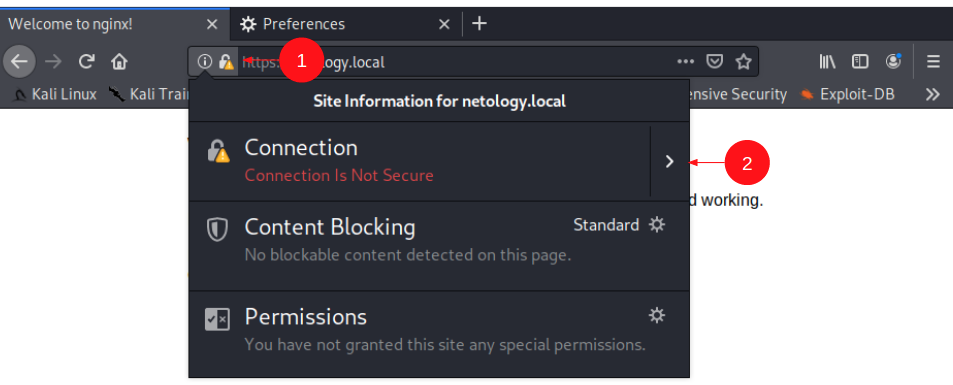

Нажмите `More Information`:


Далее `View Certificate`:

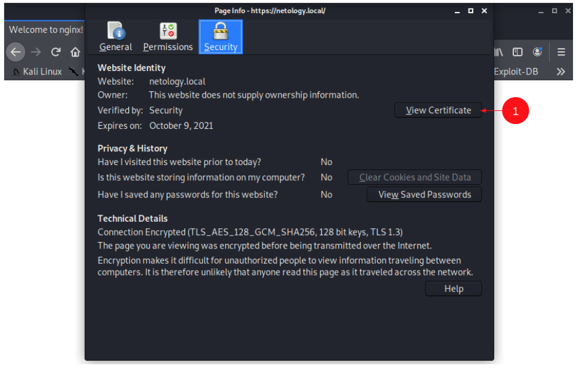

И даже его можно экспортировать вкладка `Details` и кнопка `Export`:

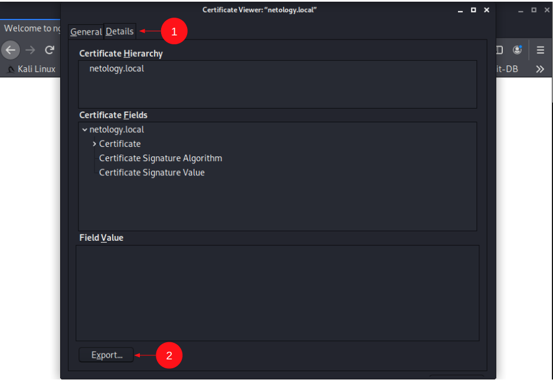

### HTTP2 

Для включения HTTP2 достаточно в конфигурацию (на Ubuntu файл `/etc/nginx/sites-enabled/default`) включить `http2`:

```text
server {
  server_name netology.local;

  listen 443 ssl http2;
  listen [::]:443 ssl http2;
  # дальше без изменений
```

Сохраняете файл, тестируете (`sudo nginx -t`), перезагружаете конфигурацию (`sudo nginx -s reload`).

В Kali удостоверяетесь, что вам теперь страничка отдаётся по HTTP2:

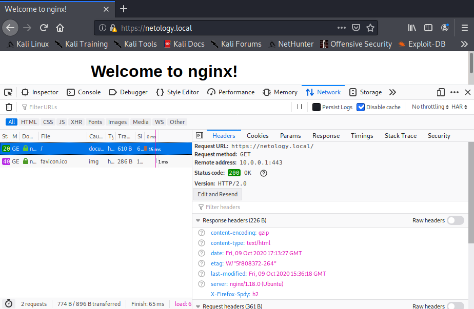


### Задача

Теперь о том, что вам нужно сделать: настройте сервер аналогично задаче, пришлите:
* сертификат
* пришлите скриншоты открытия веб-сервера в Windows (в браузере Chrome), на которых видно:
    * что страница загружается по HTTP2
    * скриншот серийного номера сертификата при просмотре в браузере
    
<details>
<summary>Настройка Windows</summary>

В Windows кликаете в таскбаре на иконке сетевого подключения:


Далее находите подключение и настраиваете его свойства:


Если вдруг в виртуальной машине второй сетевой адаптер не настраивается, то вы можете настроить его из командной строки, запустив её от имени администратора (см. лекцию про виртуальные машины):
```
netsh interface ip set address <имя адаптера> static 10.0.0.3 255.255.255.0
```

Имя адаптера можно посмотреть с помощью команды `ipconfig`:
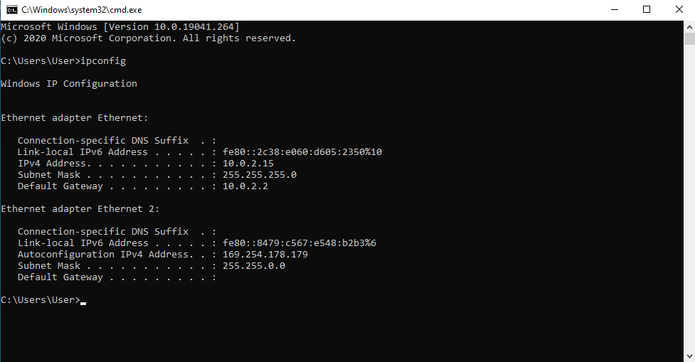

Соответственно, имя второго адаптера Ethernet 2 (с пробелом, поэтому нужно брать в кавычки):
```
netsh interface ip set address "Ethernet 2" static 10.0.0.3 255.255.255.0
```

После этого удостоверьтесь с помощью `ipconfig`, что адрес изменился.

На всякий случай напоминаем, что `etc/hosts` в Windows находится в `%SystemDirectory%\System32\Drivers\etc\hosts` (например, `C:\Windows\System32\etc\hosts`).

Лучше этот файлик скопировать на рабочий стол, отредактировать (записи добавляются в том же формате: `10.0.0.1 netology.local`), а затем поместить обратно с заменой.
</details>

<details>
<summary>Доверенные самоподписанные сертификаты в Windows</summary>

**Важно**: этот раздел не является обязательным, он просто описывает, как можно сделать сертификат доверенным.

В Windows: открываете консоль, запускаете команду `certmgr`:

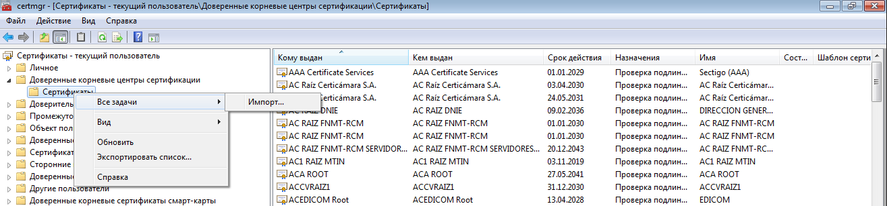

А дальше просто импортируете экспортированный сертификат в корневые хранилища. 

После этого необходимо перезапустить браузер (закрыть все окна и заново открыть):

</details>

## CTF*

**Важно**: эта задача не обязательная, её выполнение не влияет на получение (либо не получение) зачёта по ДЗ.

CTF (Capture The Flag) - одна из разновидностей "заданий" в мире ИБ.

Есть два типа:
* classic - классический, когда происходит деление на команды, которые одновременно защищают свои ресурсы и атакуют ресурсы условного противника
* task-based - решение набора задач, по итогам которого участники должны получить ключ (чаще всего это просто текст, представляющий собой текст, фразу, хэш, серийный номер и т.д.).

В чём будет состоять наша CTF:
1. Найти название первой JS-функцию, вызываемой в HTML-файле
2. Найти с помощью инструментов браузера метод, с помощью которого браузер отправляет данные при логине на сервисах Yandex
3. Определить название Cookie, который устанавливается для сохранения местоположения пользователя
4. Найти серийный номер сертификата сайта https://netology.ru

На каждый ответ вы получаете строку, которую затем используете в следующем виде:
http://localhost:9999/step1-answer/step2-answer/step3-answer.zip

Где:
* `step1-answer` - ответ на первый вопрос
* `step2-answer` - ответ на второй вопрос
* `step3-answer` - ответ на третий вопрос

В ответ вы получите zip-архив, паролем к которому будет служить ответ на четвёртый вопрос (важно: вводите номер сертификата без пробелов, в нижнем регистре и без двоеточий).

Для того, чтобы этот URL работал, вам необходимо скачать сервер для своей операционной системы:
* [Windows x86](assets/server-x32.exe)
* [Windows x64](assets/server-x64.exe)
* [Linux x86](assets/server-x32.bin)
* [Linux x64](assets/server-x64.bin)
* [Mac OS x64](assets/iserver-x64.bin)

И запускаете из командной строки в виде:
* Windows (x86): `.\server-x32.exe`
* Windows (x64): `.\server-x64.exe`
* Linux (x86): `chmod +x ./server-x32.bin && ./server-x32.bin`
* Linux (x64): `chmod +x ./server-x64.bin && ./server-x64.bin`
* Mac OS (x64): `chmod +x ./iserver-x64.bin && ./iserver-x64.bin`

Сервер запустится на порту 9999 (поэтому удостоверьтесь, что у вас на этом порту больше ничего не запущено).
* [Windows x86](assets/checker-x32.exe)
* [Windows x64](assets/checker-x64.exe)
* [Linux x86](assets/checker-x32.bin)
* [Linux x64](assets/checker-x64.bin)
* [Mac OS x64](assets/ichecker-x64.bin)

И запускаете из командной строки в виде:
* Windows (x86): `.\checker-x32.exe step1 FirstAnswer`
* Windows (x64): `.\checker-x64.exe step1 FirstAnswer`
* Linux (x86): `chmod +x ./checker-x32.bin && ./checker-x32.bin step1 FirstAnswer`
* Linux (x64): `chmod +x ./checker-x64.bin && ./checker-x64.bin step1 FirstAnswer`
* Mac OS (x64): `chmod +x ./ichecker-x64.bin && ./ichecker-x64.bin step1 FirstAnswer`

Где:
* `step1 answer` - ответ на первый вопрос
* `step2 answer` - ответ на второй вопрос
* `step3 answer` - ответ на третий вопрос
* `step4 answer` - ответ на четвёртый вопрос

Checker вам скажет, верен ответ или нет.

### Task 1

Откройте спецификацию протокола HTTP2 (RFC 7540) https://tools.ietf.org/html/rfc7540

И ответьте на вопрос: как называется первая функция JS, встречаемая в теле страницы, начиная с элемента `body`.

<details>
<summary>Описание выполнения</summary>

Как это делается? Открываете страницу в браузере, жмёте F12 и переходите на вкладку `Elements`:

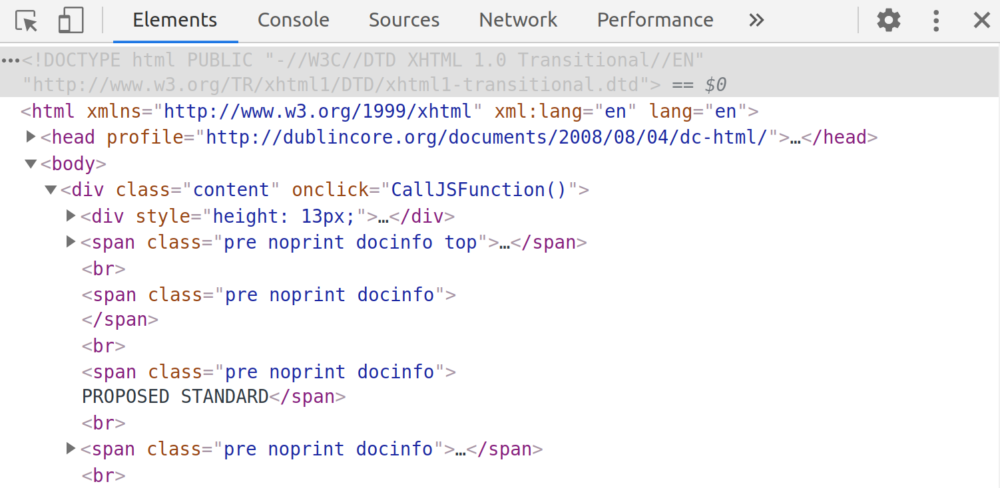

Раскрываете элемент `body` и начиная с него идёте сверху вниз, пока не встретите конструкцию вроде `on*="Stuff()"`, где вместо `*` и `Stuff` могут быть любые строки.

Например, на скриншоте, это `onclick="CallJSFunction()"`, где `CallJSFunction` - это и будет название функции.

Проверяете в Checker'е: `./checker-x64.bin step1 CallJSFunction`.
</details>

Да... ещё небольшая подсказка: "год выдался очень простым"
  
### Task 2

Определите, каким HTTP-методом отправляется ваш пароль при входе в сервисы Яндекса.

<details>
<summary>Описание выполнения</summary>

Заходите на [https://passport.yandex.ru/auth/welcome](https://passport.yandex.ru/auth/welcome).

Открываете инструменты разработчика (F12) и переходите на вкладку Network (здесь вы сможете видеть все запросы, которые делает браузер для конкретной страницы), выставляете фильтр XHR:

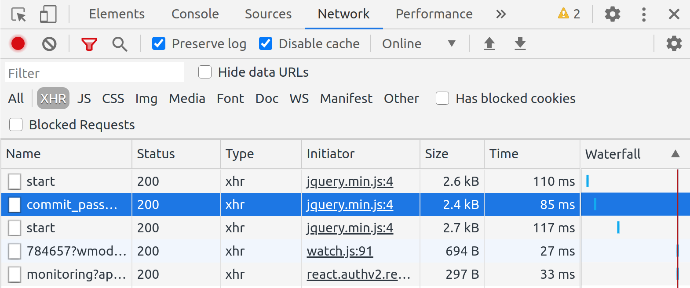

Заполняете произвольными данными форму входа:

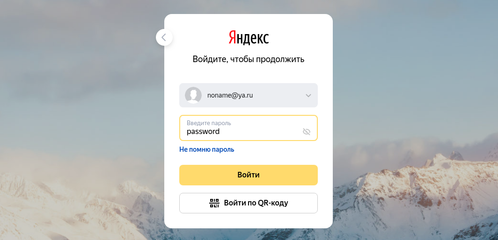
 
Нажимаете "Войти"

После чего смотрите в инструменты разработчика, выбирая последовательно запросы. Ищете тот, который появился после того, как вы нажали на кнопку "Войти". Для просмотра деталей, кликаете на нём левой кнопкой мыши:


В данном примере метод - `PUT`. Как удостовериться, что это именно тот запрос? Прокручиваете детали до самого низу и если внизу видите секцию `Form Data` с паролем, который вы вводили (а в других запросах этого пароля нет), то с большой долей вероятности, это то, что вам нужно.
</details>

### Task 3

Перейдите на страницу https://en.wikipedia.org/wiki/Cipher_suite и определите название Cookie, который устанавливается для сохранения вашего местоположения (города, страны).


<details>
<summary>Описание выполнения</summary>

Переходите на целевую страницу, открываете инструменты разработчика (F12) и переходите на вкладку Application (если она скрыта, то нужно "прокрутить" вкладки), выбираете раздел Cookie:

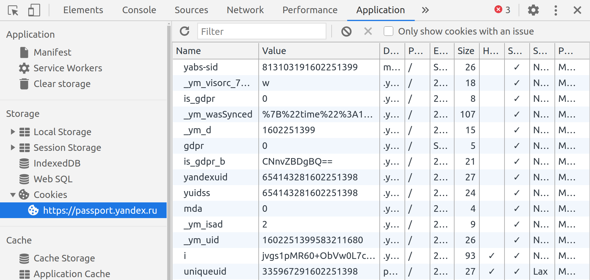

Видите все Cookie, которе устанавливает конкретный Origin (Origin - это кортеж из протокола, домена и номера порта). В данном случае он только один.

Выбирая Cookie, вы в нижней части страницы можете посмотреть их значения. Вам нужно найти такое, в котором будет зафиксирован код вашей страны, город и координаты.

</details>

### Task 4

Найдите серийный номер сертификата сайта https://netology.ru. Как это делать, вы разбирали на лекции.

Номер сертификата необходимо вводить без пробелов, двоеточий и в нижнем регистре.

### Результаты

В качестве результата пришлите ссылку, которая хранится в текстовом файле в архиве на веб-сервере.
