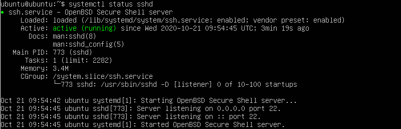
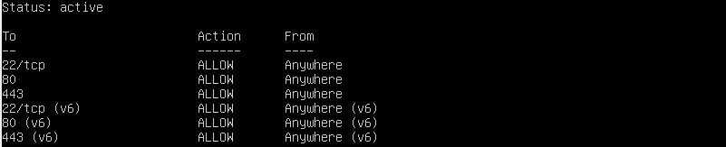
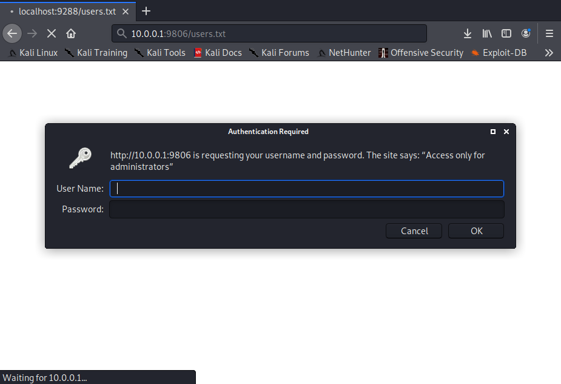

# Домашнее задание к занятию «Атаки (часть 2)»

В качестве результата пришлите ответы на вопросы в личном кабинете студента на сайте [netology.ru](https://netology.ru).

## Metasploit

Скачайте и установите на виртуальную машину Metasploitable: https://sourceforge.net/projects/metasploitable/ (если вы это не сделали ещё в ДЗ для предыдущего занятия).

Это типовая ОС для экспериментов в области информационно безопасности, с которой следует начать при анализе уязвимостей.

Сегодня нашей целью будет атака по SSH с использованием логина и пароля.

В Metasploit есть соответствующий [`auxiliary`](https://www.offensive-security.com/metasploit-unleashed/scanner-ssh-auxiliary-modules/)

Вы можете в нём задавать как файл `USERPASS`, который содержит пары логин-пароль, так и по отдельности:
* `USER_FILE` - логины пользователей
* `PASS_FILE` - пароли пользователей

Можете потренироваться на `Metasploitable`, но как вы понимаете, это не особо интересно.

Что же нужно сделать? На нашем сервере с Ubuntu мы с вами поднимем SSH сервер, который и будем брутфорсить.

### Команды на сервере Ubuntu

```shell script
sudo apt update
sudo apt install openssh-server
```

[Немного про OpenSSH](https://www.openssh.com/).

Удостоверяемся, что он запущен после установки:
```shell script
systemctl status sshd
```



Удостоверяемся, что порт 22 открыт (по умолчанию именно он используется для SSH). Как это делать, вы уже знаете:



Далее, нужно создать пользователя, пароль которого вы и будете подбирать:
```shell script
sudo adduser hackme
```

Вас попросят дважды ввести пароль (пароль не отображается в целях безопасности).

Введите один из [распространённых паролей](https://github.com/danielmiessler/SecLists/blob/master/Passwords/Common-Credentials/10-million-password-list-top-1000.txt).

Удостоверьтесь, что вы можете войти с указанным паролем:
```shell script
su hackme
# вводите пароль
# если не получаете сообщения su: Authentication Failure, то всё ок
# для выхода:
exit
```

Теперь у вас появился пользователь `hackme`, к которому и нужно подобрать пароль с помощью Metasploit (этот пользователь автоматически получает возможность логиниться по SSH, т.к. таковы дефолтные настройки OpenSSH).

### Команды на Kali

```shell script
sudo service postgresql start
sudo msfdb init
sudo msfconsole
```

В консоли Metasploit:
```shell script
use auxiliary/scanner/ssh/ssh_login
set RHOSTS 10.0.0.1
set USERNAME hackme
```

Дальнейшие настройки (указание пути к файлу с паролями и запуск) выполняете согласно лекции.

### Результаты

В качестве результата пришлите скриншот работы Metasploit, из которого видно подобранный пароль.

## Http Basic

### Легенда

Достаточно часто разработчики и даже системные администраторы не "заморачиваются" вопросами безопасности и используют самые простые механизмы для "защиты" данных.

Вот и в этот раз вышло так же. Системные администраторы, долго не думая, выложили для собственного удобства файл с пользователями, их email и паролями на внутренний HTTP-сервер.

Закрыли они это всё [Basic аутентификацией](https://tools.ietf.org/html/rfc2617) (логин и пароль передаются в заголовке `Authorization` в формате `Basic base64(login:password)`).

### Задача

Необходимо с помощью THC Hydra подобрать логин и пароль для скачивания файла.

### Описание выполнения

### На сервере с Ubuntu

На сервер с Ubuntu скачиваете [файл сервера](assets/server-x64.bin) (для удобства мы упаковали всё в один исполняемый файл)

Далее, в каталоге, куда вы скачали файл:
```shell script
chmod +x ./server-x64.bin
./server-x64.bin
```

Данная команда запустит сервер на произвольном порту от 9000 до 9999 (на каком - вы не знаете*).

**Важно**: при каждом запуске порт будет разный!

<details>
<summary>Примечание*</summary>

Конечно же, вы можете узнать это, посмотрев, какие порты в данный момент используются. Но так не совсем интересно.
</details>

Открываете порты на firewall'е с 9000 по 9999:
```shell script
sudo ufw allow 9000:9999/tcp
sudo ufw allow 9000:9999/udp
```

### На машине с Kali

Что нужно сделать:
* найти открытые порты (nmap)
* найти порт, на котором работает целевой HTTP сервер (можете попробовать определить тип сервиса с помощью nmap)
* с помощью THC Hydra подобрать логин и пароль (файл находятся по пути `http://<ip адрес сервера>:<номер порта>/users.txt`, обязательно посмотрите через WireShark, какие запросы и как шлются)

Когда вы обнаружите целевой порт, то при заходе на него получите:


Теперь, нужно воспользоваться Hydra в формате:
```shell script
hydra -L logins.txt -P passwords.txt -s <номер порта> -f 10.0.0.1 http-get /users.txt
```

Где:
* -L путь к файлу с логинами (по одному на строку, по умолчанию - текущий каталог)
* -P путь к файлу с паролями (по одному на строку, по умолчанию - текущий каталог)
* -f остановка после первого найденного совпадения
* http-get - модуль (можете прочитать справку через `hydra -U http-get`)

<details>
<summary>Подсказка</summary>

В качестве логинов достаточно часто используют `root`, `Root`, `admin`, `administrator`, `Adm`, `adm`, `Admin` и подобные.
</details>

### Результат

Пришлите логин, пароль для аутентификации, а также файл со списком пользователей в ЛК студента.
