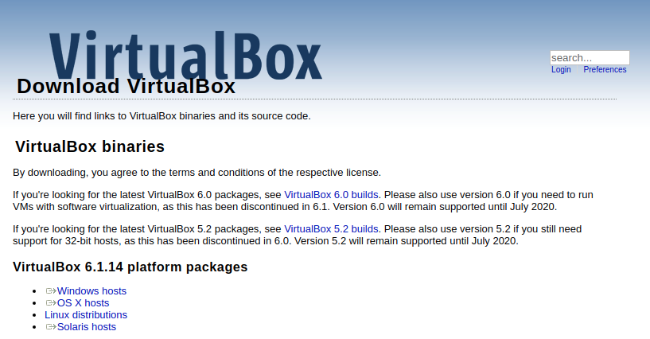
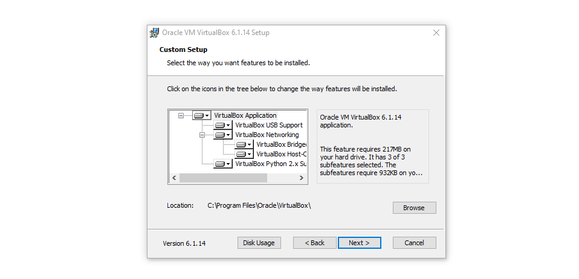
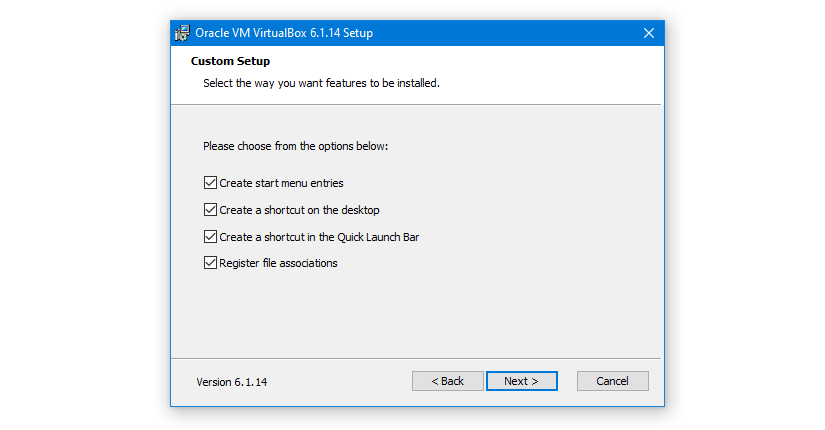
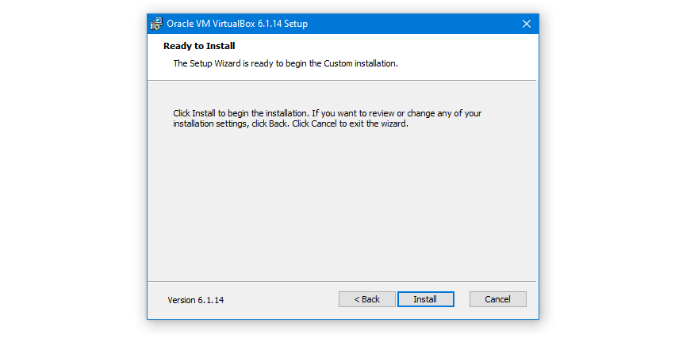
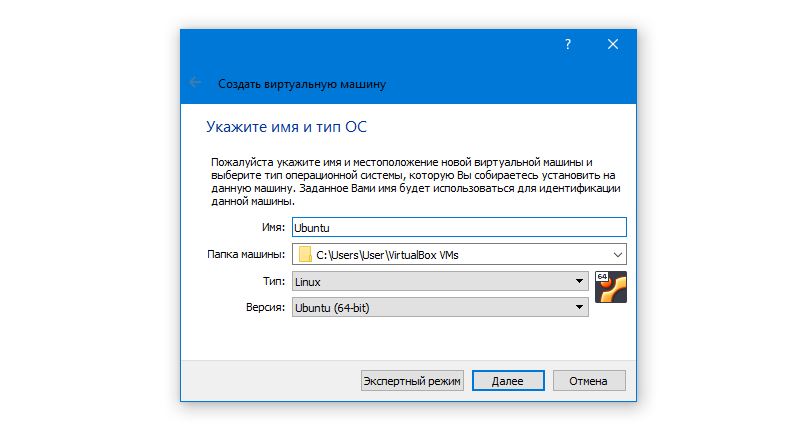
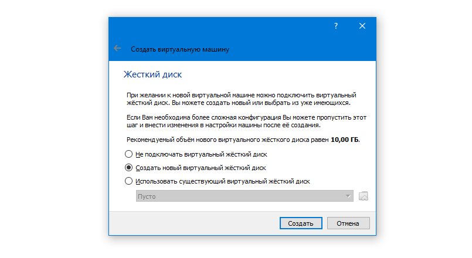

# Установка VirtualBox

В данном руководстве описана установка VirtualBox под ОС Windows. На другие ОС установка выполняется аналогично (за исключением отключения Hyper-V).

## Hyper-V

Важно: если в процессе установки и запуска VirtualBox у вас возникают сообщения с ошибками, связанными с Hyper-V, это значит, что Hyper-V и VirtualBox конфликтуют.

Поэтому на время нужно отключить Hyper-V. Чтобы это сделать, нужно:

1\. Нажмите Win + R, введите powershell и нажмите Ctrl + Shift + Enter (а не просто Enter), для того, чтобы запустить командную оболочку с привилегиями администратора:

2\. Убедитесь, что в заголовке окна написано `Администратор`:

3\. Введите команду `bcdedit /set hypervisorlaunchtype off`

4\. Перезагрузите компьютер

Для включения, соответственно, введите `bdcdedit /set /hypervisorlaunchtype auto`

## Установка

1\. Перейдите [по ссылке](https://www.virtualbox.org/wiki/Downloads) и скачайте версию VirtualBox для вашей ОС:

2\. Запустите скачанный файл на установку и нажмите Next:

3\. Оставьте все опции выбранными по умолчанию и нажмите Next:

4\. Оставьте все опции выбранными по умолчанию и нажмите Next:

5\. VirtualBox на время сбросит ваши сетевые соединения, поэтому убедитесь, что вы не скачиваете/не отправляете ничего важного, и нажмите на кнопку Next:

6\. Подтвердите установку нажатием на кнопку Install:

7\. При появлении запросов от ОС разрешите приложению внести изменения:

8\. При появлении запросов от ОС на установку ПО для устройств нажмите Установить:

9\. Дождитесь завершения установки и нажмите Finish:

10\. Если на предыдущем шаге вы оставили флажок "Start VirtualBox", то вы увидите следующее окно (если не оставили - запустите из меню Пуск). Нажмите на кнопку Создать:

11\. Введите название Ubuntu (тип Linux и Ubuntu 64-bit будут выбраны автоматически) и нажмите на кнопку Далее:

12\. Выберите объём памяти не менее 2048 Мб и нажмите Далее:

13\. Выберите опцию Создать новый виртуальный жёсткий диск и нажмите на кнопку Далее:

14\. Выберите опцию VDI и нажмите на кнопку Далее:

15\. Выберите опцию Динамический виртуальный жёсткий диск и нажмите на кнопку Далее:

Важно: Прочитайте внимательно отличие динамического от фиксированного.

16\. Если вы выбрали Динамический, то установите размер в 40 Гб и нажмите на кнопку Далее:

17\. После всех настроек, VM появится в списке, выберите VM и нажмите на кнопку Настроить:

18\. (слева-направо) Зайдите в пункт Носители, выберите иконку с оптическим диском и опцию Выбрать файл диска...:

19\. Выберите ISO-образ операционной системы, которую вы хотите установить, после чего нажмите ОК:

20\. Запустите VM двойным кликом по названию (дальнейшие действия завися от выбранной вами ОС):

